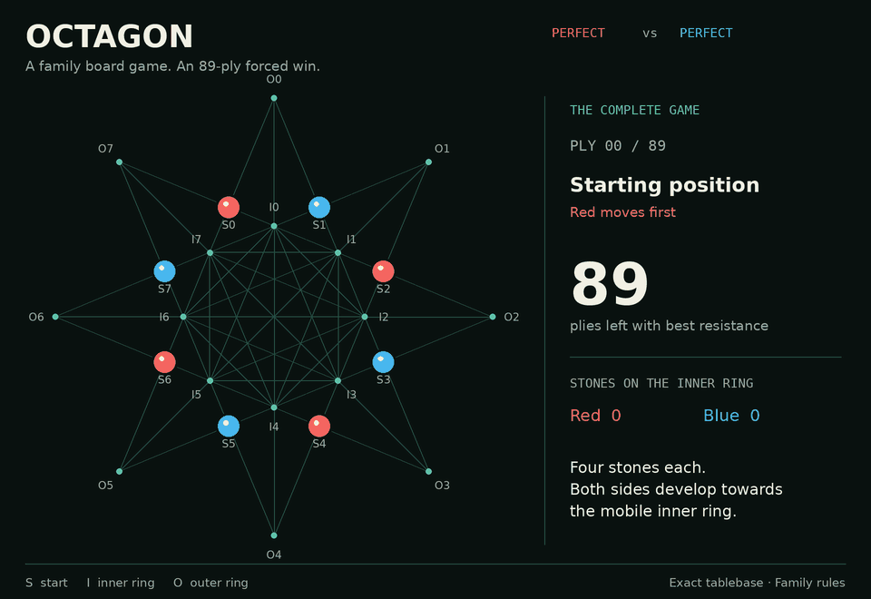
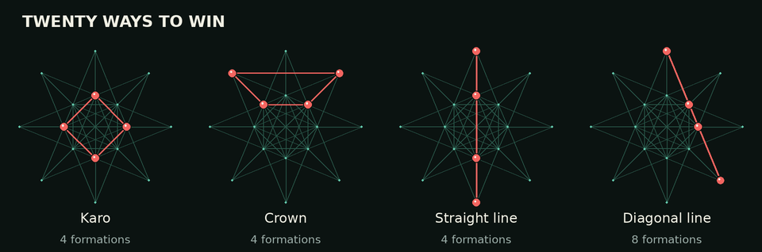
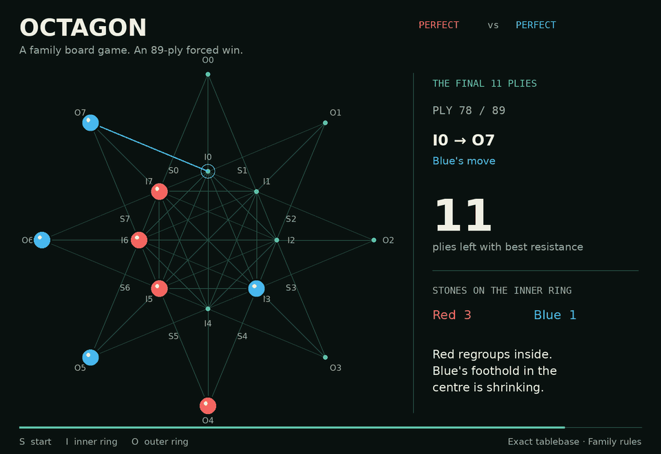

# Octagon

For a time, my great-uncle held the records for the most bicycles balanced on his head (five) and the longest distance walked with a bicycle balanced on his head (600 metres). He worked as a magician, travelled with a circus, painted houses, worked in a bottling factory, and invented board games in the 1980s. Once in a while, we go to his place and try a few. The one I liked most was the simplest: Octagon.

Each player has four stones. Move them into a winning formation before the other player does. I wondered **whether the first player could force a win**, whether the second player could, or whether perfect defence would always hold. I wrote down the rules in Python, built a little interface, and made a fairly basic opponent. Years later, with agentic AI, I returned to the question and solved the game computationally.

**On the family board, the first player can force a win in 89 plies: 45 moves for Red, 44 for Blue.** A ply is one move by one player. Red wins as quickly as possible; Blue makes that take as long as possible. What still astonishes me is that the opening advantage is enough to force a win, yet takes so long to convert. I had expected a draw.



*One complete game between the shipped Perfect engines, sped up. Red wins on its 45th move. [Read the full move list and see the still boards](docs/perfect-game.md).*

## Play

The browser game runs locally with no build step or JavaScript dependencies. From the repository root:

```sh
python3 -m http.server 8000 --directory web
```

Open [localhost:8000](http://localhost:8000). Play against another person, choose an engine from Easy to Perfect, or select **Engine vs Engine** and set both strengths to **Perfect** to watch the long game yourself. **Evaluation**, **Best move**, and **Winning positions** help explain the board as you play.

Perfect loads an 8.3 MB tablebase on first use. All play and analysis then happen in your browser. The [web README](web/README.md) explains embedding the game and using its independent rules and engine modules.

## How it works

Red and Blue start with four stones each on alternating start points. Red moves first. On each turn, move one of your stones to a connected, empty destination. There are no captures and no passes. Once a stone leaves its start point, it cannot return; you can move an already deployed stone while others are still waiting to enter.

The board has eight inner points and eight outer points. Every inner point connects to all seven other inner points, plus three nearby outer points. Each outer point connects to three inner points. This makes the centre unusually mobile. The browser highlights legal destinations when you select a stone; the outer square outlines help you recognise formations.

Win immediately by arranging all four stones into one of **20 formations**:



- **Karo:** every other point on either ring, making a small or large square; four formations.
- **Crown:** the two inner and two outer points flanking a cardinal axis; four formations.
- **Straight line:** two opposite inner points and the two corresponding outer points; four formations.
- **Diagonal line:** four points along one of the long, slanted board lines; eight formations.

Start points never count towards a win. The browser declares a draw on threefold repetition or when a player has no legal move. See the [photographed family board](octagon_proper_layout.jpg) and [precise rules](THEORY.md#family-board-reconstruction) for the geometry and movement definitions.

## What optimal play looks like

For a long time, both engines seem to have credible threats. Red repeatedly regroups on the inner ring and works to force Blue towards the outside. The centre changes hands along the way; its occupation gives stones more options for both making formations and answering threats. On this particular line, all four Blue stones are outside by ply 82. Blue returns to the centre, but Red has time to arrange the finishing line.



*The same game's final eleven plies. After ply 87, Red threatens `I4 → O5`. None of Blue's stones can reach `O5` in one move, and Blue has no immediate winning reply. Red completes the line on ply 89.*

That is a way to read the replay. The exact characterisation of optimal play comes from the solved positions:

- **With a forced win**, preserve it and choose the move with the shortest distance to victory.
- **With a forced loss**, choose the move that delays defeat the longest.
- **With a draw**, keep a drawn position. The Perfect engine breaks ties by favouring positions where a larger fraction of opposing replies would throw the draw away.

Even the first move matters. Label the start points `S0…S7`, the inner ring `I0…I7`, and the outer ring `O0…O7`. Ring indices run clockwise from the top; `S_i` lies between `I_(i−1)` and `I_i`. The [labelled opening board](docs/media/opening.png) makes the notation easier to follow. The 16 legal openings fall into four classes under quarter-turn rotations:

| Representative opening | Result for Red with best play | Total plies |
|---|---|---:|
| `S0 → I0` | Win | 89 |
| `S0 → I7` | Draw | — |
| `S0 → O0` | Loss | 90 |
| `S0 → O7` | Loss | 92 |

Only **four of the sixteen first moves preserve the win**. Along the recorded game, Red has exactly one win-preserving move on **10 of its 45 turns**. The average fraction of legal moves that preserve Red's win, calculated separately on each Red turn, is **29.9%**. Other equally optimal lines can have different choice profiles.

The 89-ply result gives the time needed against the best resistance: Red can guarantee victory by then, and Blue can prevent it happening sooner. A weaker defence can lose earlier. The number describes a forced conversion, rather than the search depth needed to find a move or the likely length of a human game. The [full analysis](THEORY.md) gives the exact results and their assumptions.

## What I wrote, and what came later

**Before I used agentic AI on this project, 2022–2024.** The game itself is my great-uncle's invention. I implemented the board state, legal moves, and winning patterns in Python in 2022. In December 2024, I added an OpenCV board, mouse interaction, human-versus-human play, and a basic engine with a hand-written evaluation of how close each side was to winning formations. The original work remains in [octagon.py](octagon.py), [shapes.py](shapes.py), and the three `testing_*.py` scripts.

**With agentic AI, 2026.** I used coding agents to take the project further: reconstruct the family rules from the board photograph and earlier code, build the browser version, implement stronger search opponents, and write an exact solver. That produced the 89-ply result and the tablebase behind the Perfect engine. The browser game and solver entered the repository in August 2026. Subsequent work explored how changes to the winning formations, movement, and deployment affect the result.

The agents helped develop the software and analysis. During a game, the opponents use ordinary local algorithms: tactical rules, alpha-beta search, or exact tablebase lookups. The original Python prototype and the later solution are both here, so you can follow the project from the first playable experiment to its answer.

One detail mattered enormously: **the 2024 prototype encodes a different, simplified game**. Its opening is a draw with perfect play. The restored **Family board** (`proper`) is the game with the 89-ply win; the older rules remain available to API consumers as `legacy`. The [rules reconstruction](THEORY.md) documents both.

## How the answer was obtained

The C++ solver enumerates every position reachable from the opening, identifies equivalent positions under the four valid quarter-turn rotations, and works backwards from completed formations. A position is winning if a move leaves the opponent a losing position; it is losing if every move leaves the opponent a winning position. The positions left outside those forced-win regions are draws, where neither side can force a finite victory.

For the family game, this covers **5,527,111 canonical positions** and **84,458,408 distinct-successor edges**. Computing the shortest wins and longest resistance gives the distance from each decisive position. The browser's tablebase stores the outcome and distance; its Perfect engine checks legal successors to choose a move.

This is an exhaustive computational solution for the encoded rules. The interpretation about control of the centre helps make sense of the play; the result itself rests on the graph calculation.

To reproduce the solution with a C++17 compiler:

```sh
g++ -O3 -std=c++17 theory_solver.cpp -o /tmp/octagon_theory_solver
/tmp/octagon_theory_solver proper stalemate-draw
```

The solver prints the opening result and the complete optimal line. To check the browser rules and engines with Node:

```sh
node --test web/game-engine.test.mjs web/ai-engine.test.mjs web/perfect-engine.test.mjs
```

The tests include Perfect-versus-Perfect play ending on ply 89. The [animation generator](docs/readme-media.md) independently replays both shipped engines and checks every recorded position against the tablebase.

## What happens if the rules change?

The follow-up [sensitivity analysis](SENSITIVITY.md) solves 50 variations. Remove any whole winning family and the original opening becomes a draw. Remove just the two outer squares, however, and a forced win survives in 39 plies. Add the other four crown orientations and it becomes 45 plies. Allow passing and it draws.

Those results make the original's long game more interesting to me: the different formations and movement rules interact in ways that are hard to guess just by looking at the board. The [interactive explorer](analysis/explorer.html) lets you compare the variants, inspect their winning formations, and replay their optimal lines. Download it and open it in your browser, or serve the repository root locally.
