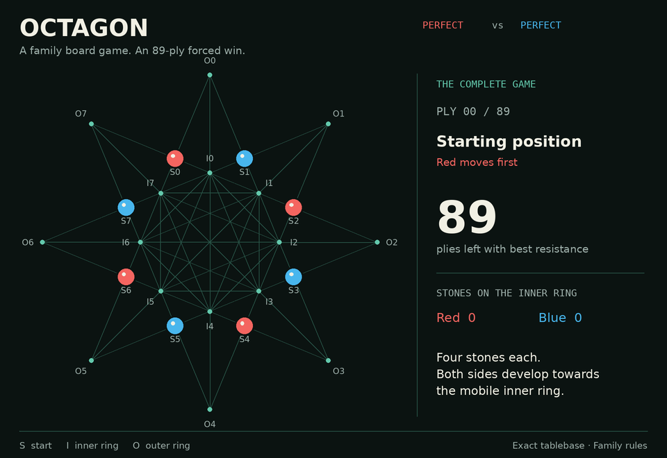
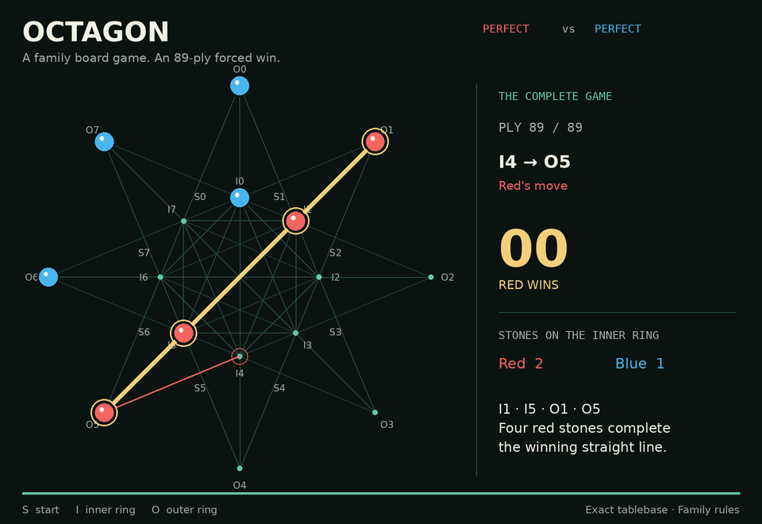

# One perfect game of Octagon

This is the exact game shown in the README GIFs. Both sides use the shipped
Perfect engine: Red chooses the shortest forced win; Blue delays it as long
as possible. Equal choices are resolved by source and destination index.

The result is **Red wins on ply 89**, its 45th move. This is one optimal line;
other equally good continuations exist. Each recorded state has been checked
against the tablebase, with the distance decreasing by one on every ply.

`S0…S7` are start points, `I0…I7` the inner ring, and `O0…O7` the outer ring.
The ring labels run clockwise from the top; `S_i` lies between `I_(i−1)`
and `I_i`. Red starts on the even-numbered S points and moves first.

| Move | Red | Blue | Plies remaining after this row |
|---:|---|---|---:|
| 1 | S0 → I0 | S3 → I2 | 87 |
| 2 | S2 → I1 | S7 → I6 | 85 |
| 3 | S6 → I5 | S5 → I4 | 83 |
| 4 | S4 → I3 | I2 → I7 | 81 |
| 5 | I3 → I2 | S1 → O1 | 79 |
| 6 | I5 → I3 | I4 → O3 | 77 |
| 7 | I3 → I4 | I7 → O7 | 75 |
| 8 | I4 → O5 | O3 → I3 | 73 |
| 9 | I1 → I7 | O1 → I1 | 71 |
| 10 | O5 → I5 | I1 → O1 | 69 |
| 11 | I0 → I4 | I3 → O3 | 67 |
| 12 | I5 → O5 | O3 → I3 | 65 |
| 13 | I2 → I0 | I3 → I5 | 63 |
| 14 | I4 → I3 | O1 → I1 | 61 |
| 15 | O5 → I4 | I6 → I2 | 59 |
| 16 | I3 → O4 | I1 → O0 | 57 |
| 17 | I4 → I1 | O7 → I6 | 55 |
| 18 | O4 → I4 | I6 → O6 | 53 |
| 19 | I7 → I3 | I2 → O2 | 51 |
| 20 | I4 → O4 | O2 → I2 | 49 |
| 21 | I3 → I6 | O6 → I7 | 47 |
| 22 | O4 → I3 | I2 → O2 | 45 |
| 23 | I3 → I2 | I7 → I4 | 43 |
| 24 | I1 → I3 | I5 → I7 | 41 |
| 25 | I6 → I5 | I4 → O4 | 39 |
| 26 | I5 → O6 | O4 → I4 | 37 |
| 27 | I3 → I1 | O2 → I3 | 35 |
| 28 | I0 → I6 | I3 → O2 | 33 |
| 29 | I2 → I0 | I4 → I5 | 31 |
| 30 | I6 → I2 | I5 → I4 | 29 |
| 31 | I2 → I5 | I4 → I3 | 27 |
| 32 | I5 → I4 | I3 → I6 | 25 |
| 33 | O6 → I5 | O2 → I2 | 23 |
| 34 | I0 → I3 | I6 → O5 | 21 |
| 35 | I1 → I6 | O0 → I0 | 19 |
| 36 | I3 → O3 | I7 → O6 | 17 |
| 37 | I4 → I7 | I0 → I3 | 15 |
| 38 | O3 → I4 | I2 → I0 | 13 |
| 39 | I4 → O4 | I0 → O7 | 11 |
| 40 | I5 → I4 | I3 → I1 | 9 |
| 41 | I6 → I0 | I1 → O0 | 7 |
| 42 | O4 → I5 | O5 → I6 | 5 |
| 43 | I7 → I1 | I6 → I2 | 3 |
| 44 | I0 → O1 | I2 → I0 | 1 |
| 45 | I4 → O5 | — | 0 |

Final Red stones: `I1, I5, O1, O5`. Final Blue stones: `I0, O0, O6, O7`.

The move list, all 90 positions, opening values, and move-choice counts are
also available as [JSON](perfect-game.json). To regenerate the media, see
[readme-media.md](readme-media.md).

Tablebase SHA-256: `d592a34f52a0ca94f59d8e1ee183598d6e4b28c5f2324c7c8adb474c445b437a`.
